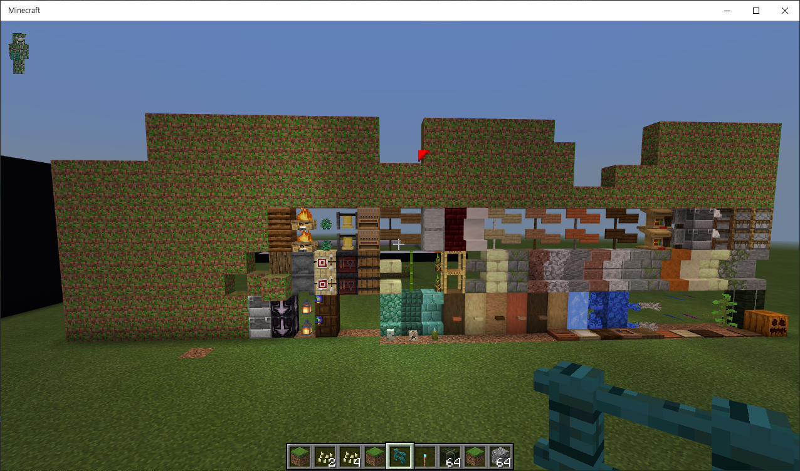

  
     
  <h1></h1>   

    
    
    
  
  <h1><strong> Library that force registration of the missing block runtime ID </strong></h1>   

  

## :clipboard: Table of Contents  
- [:book: Introduction](#book-introduction)  
- [:package: Downloads](#package-downloads)  
- [:memo: License](#memo-license)  
  
   
  
## :book: Introduction  
PMMP creates and uses vanilla data files. [at HERE](https://github.com/pmmp/BedrockData)  
  
However, `r12_to_current_block_map.bin` file being used for runtime ID registration has not been updated yet, so blocks with ID 470 or higher are still not registered with runtime ID.  
  
This library ignores the largely obsolete above files and forces all runtime IDs to be registered.  

> This feature doesn't really help much for API 3.0.0, where you can't install blocks above id 255.  
> I recommend using a plugin that makes more blocks placable, or use PMMP API 4.0.0.  
  
---------------   
  
#### BEFORE 
  
  
#### AFTER 
  
  
   
  
## :package: Downloads:  
You can use this library with poggit.  
- Go to [**Poggit**](https://poggit.pmmp.io/ci/PresentKim/runtimeid-polyfill/~)   
  
   
  
## :memo: License  
> You can check out the full license [here](LICENSE)  
  
This project is licensed under the terms of the **MIT** license  